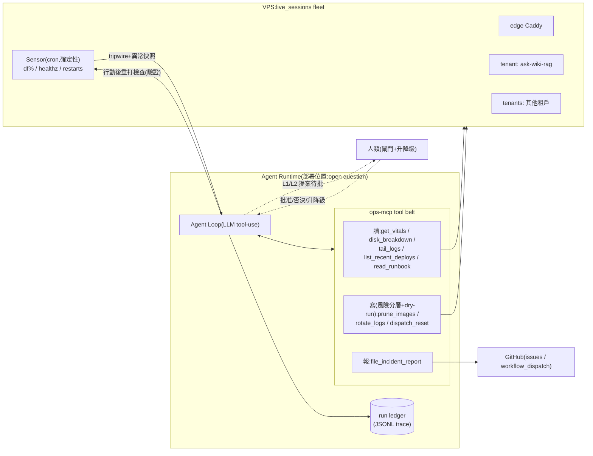
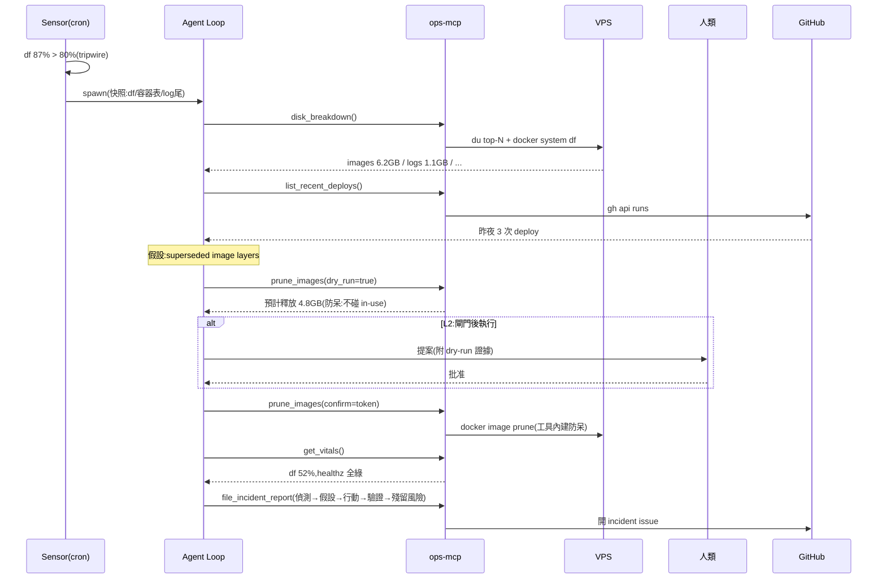

# 系統架構總覽(working draft,grill 對齊用)

> 2026-07-11 起草。狀態:**Phase 1 範圍已定,細節仍在 grill**(見 roadmap.md 的 Open Questions)。
> 本文件的 Mermaid 是對齊用活圖;若日後進 README 面向面試官,依慣例 render 成 PNG 再 commit。

## 一句話

一個**維運 agent**:笨感測器發現 VPS fleet 異常時喚醒它,它用一組風險分層的工具診斷、
(閘門後)修復、**行動後自我驗證**、產出 incident report;自治權沿階梯逐步升級,
任何驗證失敗自動降級。

## 設計原則(每一條都是 grill 定案)

1. **感測與智能解耦**:LLM 不進輪詢迴圈。感測器是確定性 shell/cron(df%、healthz、
   restart count),tripwire 才 spawn agent,並附上「異常快照」作為初始 context。
   之後換成 alert webhook 時,agent 一行不改。
2. **Agent 值得存在的四條件**(選域判準):環境不確定 / 工具豐富且選擇有代價 /
   結果可驗證 / 任務重複發生。缺一退化成 pipeline 或玩具。
3. **工具是骨,迴圈是皮**:八成工程量在 tool belt——顆粒度(一呼叫=一決策)、
   描述即 prompt、風險分層(讀/寫/dry-run)、工具內建確定性防呆(安全不外包給模型)、
   輸出塑形(有界、結構化,tool 輸出是給模型的 UX)。
4. **驗證面第一**:每個變更動作都有客觀 post-condition(重打 sensor 檢查)。
   沒有驗證面的行動不進白名單。
5. **Autonomy ladder(runtime 版 merge ladder)**:見下表;降級規則與 kbqabot
   的 rung 降級同構。

## 系統圖

## Disk-full tracer bullet 時序(Phase 1 的縱切)

## Autonomy ladder(runtime)

| 級 | 行為 | 升級條件 | 降級觸發 |
|---|---|---|---|
| L0 觀察 | 只診斷+報告 | — | — |
| L1 提案 | 報告+具體行動計畫(附 dry-run 輸出) | 診斷被人類判定準確 N 次 | 誤診斷 |
| L2 閘門執行 | 人批准後執行+自我驗證 | 同一(行動,條件)對連續綠 N 次 | 驗證紅 |
| L3 白名單自治 | 白名單內免批准,事後報告 | — | 任何一次驗證紅/誤行動 → 該行動類降一級 |

不變量:**白名單以(行動,條件)對為單位,不是以行動為單位**(「prune images」可白名單,
「prune volumes」永不;同 kbqabot「prod-fragile 永遠停 Rung 2」的思想)。

## 與 JD 的對映(誠實版)

| JD 句 | 本專案的承載 |
|---|---|
| Agentic workflow 完成複雜任務 | 診斷分支(每次 incident 形態不同)+ 多步工具決策 + 驗證迴圈 |
| 建立 Tools/Skills/APIs(資料查詢/文件解析/系統整合/流程自動化) | ops-mcp:讀工具(查詢)/read_runbook(文件)/SSH+docker+gh 包裝(整合)/dispatch+report(自動化) |
| Orchestrator:任務拆解/工具選擇/結果驗證/錯誤處理/fallback/retry | Agent loop + autonomy ladder + 驗證面 + 降級規則 |
| Multi-Agent | **Phase 3 才進場**:diagnoser/remediator/verifier 分離(builder≠verifier≠merger 的 runtime 版)。單 agent 沒跑通前不做——multi-agent 是手段不是目標 |
| 部署維運(Docker/k8s/CI-CD/AI Gateway) | Phase 4:agent 自身的服務化、model fallback/budget、k8s |
